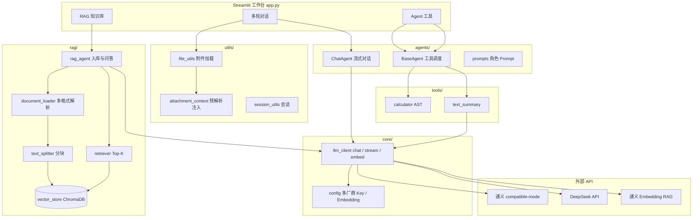
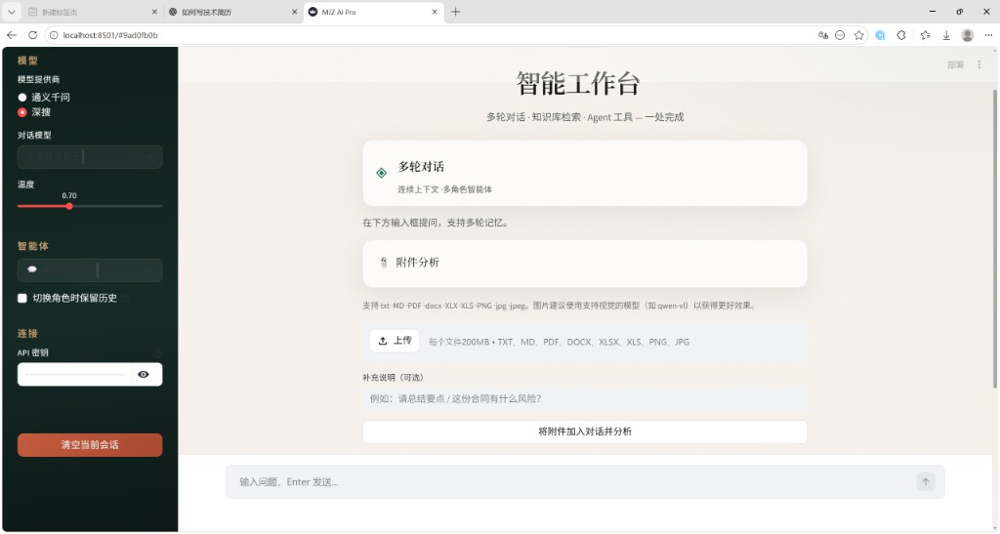
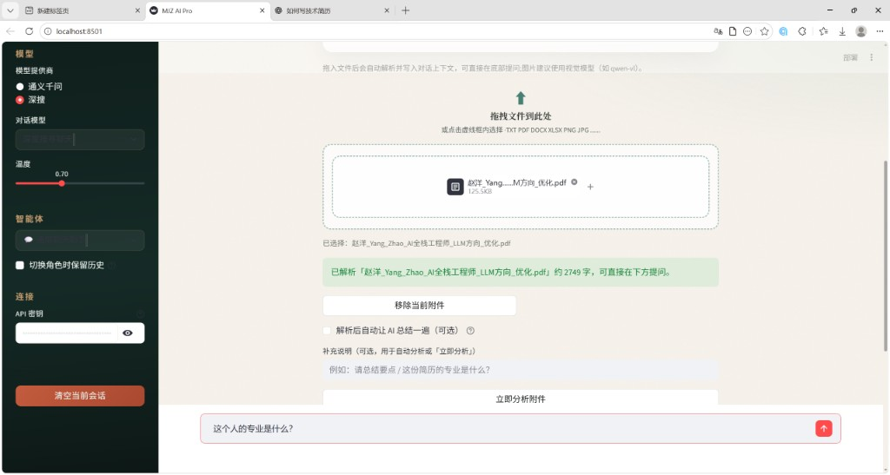
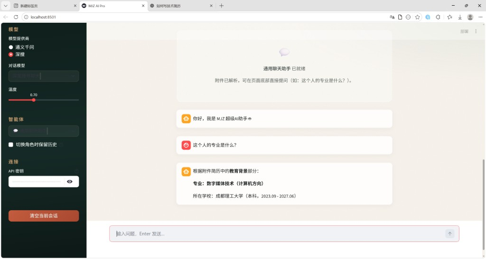
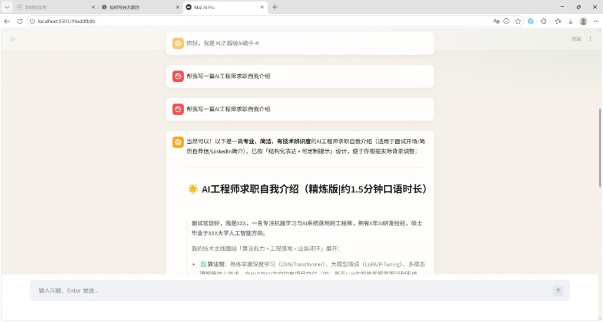
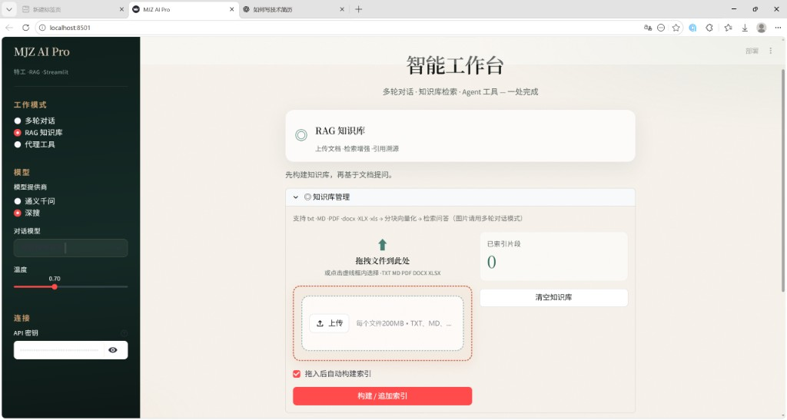
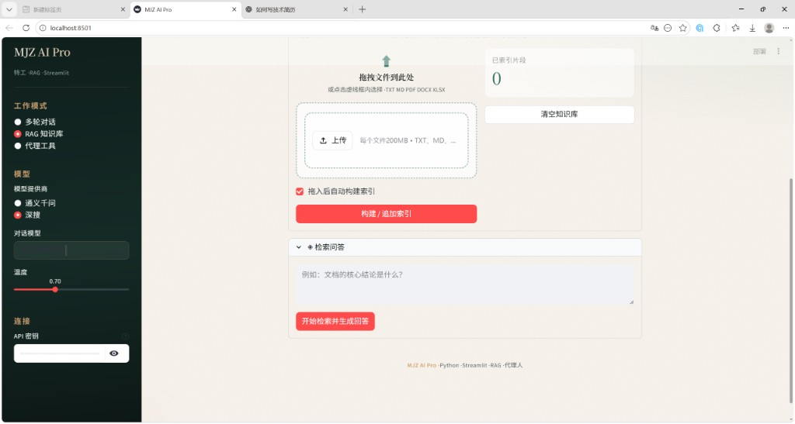
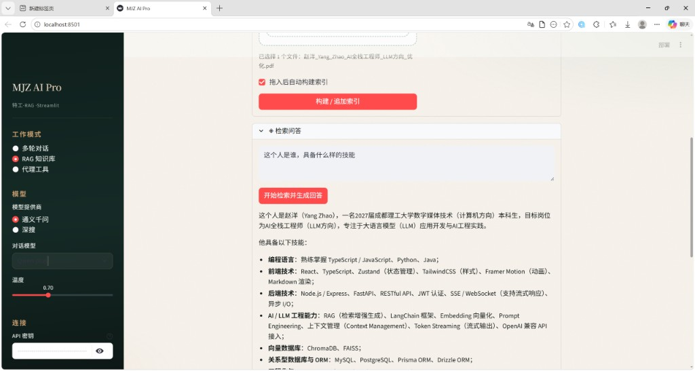

# MJZ AI Pro

<p align="center">
  <strong>Python · Streamlit · RAG · LLM 应用工程原型</strong><br/>
  多轮对话 · 知识库检索 · Agent 工具 · 多格式附件解析
</p>

<p align="center">
  <a href="https://github.com/MJZ66/mjz-ai-pro"></a>
  
  
  
  
</p>

---

## 项目介绍

**MJZ AI Pro** 是一个面向 **LLM 应用工程 / RAG / AI 全栈** 方向的实战型原型：在单一 Streamlit 工作台中完成「对话 + 检索增强 + 工具调用 + 文档附件」闭环，适合校招/实习简历项目与面试演示。

| 维度 | 说明 |
|------|------|
| 定位 | AI 应用层工程化原型（非空壳 Demo） |
| 对话 | 6 类智能体角色，支持流式输出与多轮上下文 |
| 附件 | PDF / Word / Excel / 图片拖入即解析，可连续追问 |
| RAG | 文档分块 → 向量化 → ChromaDB → Top-K 检索 → 引用溯源 |
| 模型 | 通义千问、DeepSeek（OpenAI Compatible API） |
| 工程 | 分层模块、`pytest`、配置校验、密钥不入库 |

> 在线仓库：[https://github.com/MJZ66/mjz-ai-pro](https://github.com/MJZ66/mjz-ai-pro)

---

## 项目架构图



**数据流简述**

1. **多轮对话**：用户输入 / 附件 → `attachment_context` 写入 System → `ChatAgent` → 流式回复。  
2. **RAG**：上传文档 → 分块 → `embed_texts` → ChromaDB → 问题向量检索 → 拼接上下文 → LLM 生成 +【引用】。  
3. **Agent 工具**：选择工具 → `calculator` 本地 AST 求值 / `text_summary` 调 LLM。

---

## 功能展示

| 模式 | 能力 | 典型场景 |
|------|------|----------|
| 多轮对话 | 角色 Prompt、流式输出、会话管理 | 简历分析、代码助手、文案生成 |
| 附件能力 | 拖入解析、System 注入、免「先点分析」 | PDF 简历 →「这个人的专业是什么？」 |
| RAG 知识库 | 多格式入库、检索问答、引用片段 | 技术文档 / 笔记库问答 |
| Agent 工具 | 安全计算器、文本摘要 | `(125+76)*9`、长文总结 |
| 多模型 | 通义 / DeepSeek 切换；RAG 向量固定通义 | 对话用 DeepSeek，向量用 DashScope |

---

## 运行截图

<p align="center"><strong>智能工作台总览</strong></p>

<p align="center">
  
</p>

<p align="center"><strong>多轮对话 · 附件上传与简历追问</strong></p>

<table>
  <tr>
    <td width="50%"></td>
    <td width="50%"></td>
  </tr>
</table>

<p align="center"><strong>智能体生成 · 求职自我介绍</strong></p>

<p align="center">
  
</p>

<p align="center"><strong>RAG 知识库 · 构建索引与检索问答</strong></p>

<table>
  <tr>
    <td width="50%"></td>
    <td width="50%"></td>
  </tr>
</table>

<p align="center"><strong>RAG 问答效果（基于上传简历 PDF）</strong></p>

<p align="center">
  
</p>

---

## 快速启动

```bash
git clone https://github.com/MJZ66/mjz-ai-pro.git
cd mjz-ai-pro

python -m venv .venv
# Windows: .venv\Scripts\activate
# macOS/Linux: source .venv/bin/activate

pip install -r requirements.txt
copy .env.example .env    # 填入你自己的 Key，勿提交 .env
streamlit run app.py
```

浏览器访问 **http://localhost:8501**。侧边栏 API Key 可留空（自动读取项目根目录 `.env`）。

配置详解见 [docs/配置与安全说明.md](docs/配置与安全说明.md)。

---

## 技术栈

| 层级 | 技术 |
|------|------|
| 语言 | Python 3.8+ |
| UI | Streamlit、自定义主题（Fraunces + Sora） |
| LLM | OpenAI SDK · Compatible API（通义 / DeepSeek） |
| RAG | ChromaDB、自研分块/检索流水线 |
| 文档 | PyPDF2、python-docx、openpyxl、Pillow |
| 工程 | python-dotenv、pytest、分层包结构 |

---

## 项目亮点

1. **RAG 全链路**：解析 → 分块 → Embedding → 持久化向量库 → Top-K → 引用溯源，而非单次 Prompt 塞全文。  
2. **附件预解析**：上传即写入 `session_state` + System 注入，解决「已上传但追问失忆」问题。  
3. **多厂商配置分离**：DeepSeek 对话 Key 与通义 Embedding Key 解耦，避免 401/404。  
4. **安全计算器**：`ast` 白名单求值，拒绝裸 `eval`。  
5. **可测试**：47+ 单元测试覆盖配置、RAG、附件、计算器、数学意图等。  
6. **工程化意识**：`.env.example`、SECURITY、日志与友好错误、`.gitignore` 排除密钥与向量数据。

---

## 目录结构

```
mjz-ai-pro/
├── app.py                      # Streamlit 主入口（三模式路由）
├── core/
│   ├── config.py               # 环境变量、厂商/Embedding 解析
│   └── llm_client.py           # chat / stream / embeddings
├── agents/
│   ├── chat_agent.py           # 多轮对话
│   ├── base_agent.py           # 工具注册调度
│   └── prompts.py              # 6 类角色 System Prompt
├── rag/
│   ├── document_loader.py
│   ├── text_splitter.py
│   ├── vector_store.py         # ChromaDB
│   ├── retriever.py
│   └── rag_agent.py
├── tools/
│   ├── calculator.py
│   └── text_summary.py
├── ui/                         # 主题、上传区、面板
├── utils/                      # 文件、附件上下文、会话、流式 UI
├── tests/
├── docs/
├── assets/                     # README 运行截图
├── .env.example
└── requirements.txt
```

---

## 测试

```bash
pytest tests/ -v
```

---

## 未来规划

- [ ] Streamlit Cloud / Docker 一键部署
- [ ] PyPDF2 → pypdf，提升 PDF 中文解析质量
- [ ] 混合检索（关键词 + 向量）与重排序
- [ ] 更多 Agent 工具（网页摘要、代码执行沙箱）
- [ ] 对话导出 Markdown / 知识库批量管理

---

## 文档与安全

| 文档 | 说明 |
|------|------|
| [docs/配置与安全说明.md](docs/配置与安全说明.md) | Key 配置、RAG Embedding、防泄露自检 |
| [docs/MJZ_AI_Pro_实施报告.md](docs/MJZ_AI_Pro_实施报告.md) | 分阶段实施记录 |
| [SECURITY.md](SECURITY.md) | 安全政策 |

**切勿**将 `.env`、真实 API Key 提交到 Git。

---

## License

MIT © [MJZ66](https://github.com/MJZ66)
